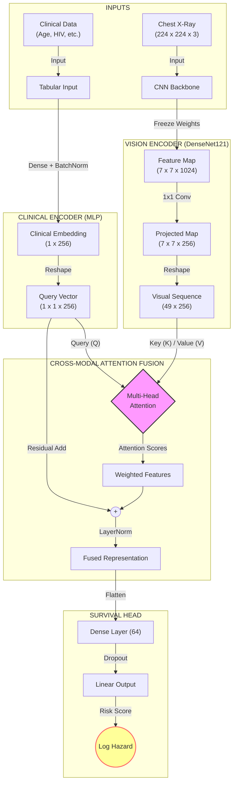

<<<<<<< HEAD
# 🫁 Multimodal Survival Analysis for Tuberculosis
=======
# 🫁 TBSurvivalNet: Multimodal Survival Analysis for Tuberculosis
>>>>>>> dev


**Author:** Dr. Ikechukwu Ephraim Ugbo, MD  
**Focus:** Cross-Modal Deep Learning (CXR + Clinical Data) for Prognosis

## 📌 Project Overview
**TBSurvivalNet** is a State-of-the-Art (SOTA) Multimodal AI framework designed to predict time-to-event (survival analysis) in Pulmonary Tuberculosis patients.

Unlike traditional "Late Fusion" models, this architecture uses **Cross-Modal Attention**. The model treats clinical variables (e.g., HIV status, Age) as a **Query** that "searches" the Chest X-ray (the **Key/Value**) for relevant spatial features, mimicking how a radiologist uses patient history to focus on specific lung regions.

---

## 🏗️ Model Architecture
The model fuses unstructured imaging data with structured clinical data using a Transformer-based attention block.



🧬 Data Pipeline (Hybrid Real + Synthetic)

Due to the scarcity of public TB datasets with complete longitudinal survival data, this project employs a scientifically grounded hybrid approach:
 * Real Images: Uses the Shenzhen Tuberculosis CXR Dataset (Real X-rays, Age, Sex).
 * Synthetic Clinical Data: Missing covariates (HIV, BMI, Diabetes) are synthesized based on epidemiological prevalence.
 * Smart Labeling: Survival times are generated using a probabilistic hazard function based on radiographic severity (e.g., cavitation, miliary patterns) and comorbidities.
🛡️ Strict Data Hygiene
To prevent Data Leakage, the pipeline enforces:
 * 3-Way Split:
   * Train (70%): For learning weights.
   * Validation (15%): For Early Stopping and Scheduler.
   * Test (15%): A pure hold-out set for final C-Index calculation.
 * Patient-Level Splitting: Ensures all images from the same patient stay in the same split.
 * Fit/Transform Logic: Tabular scalers (StandardScaler) are fit only on the Training set and applied to Val/Test.

📂 Repository Structure
```bash
tb-cxr-survival/
├── data/                   # (Ignored by Git)
│   ├── raw/                # Shenzhen Images
│   └── processed/          # master_dataset.csv
├── notebooks/
│   └── 01_tb_cxr_survival.ipynb  # Main End-to-End Notebook
├── src/
│   ├── config.py           # Hyperparameters & Seeds
│   ├── data_utils.py       # Data Loading, Splitting, & Augmentation
│   ├── model_utils.py      # TBSurvivalNet Architecture
│   ├── survival_utils.py   # Custom Cox Loss & Hazard Functions
│   ├── callbacks.py        # Training Callbacks (EarlyStopping, etc.)
│   └── explainability_utils.py # Grad-CAM & Clinical Patient Reports
└── outputs/                # Saved models (.keras) and logs
```

🚀 How to Run
 * Install Dependencies:
<!-- end list -->
pip install -r requirements.txt

 * Run the Notebook:
   Open notebooks/01_tb_cxr_survival.ipynb. The notebook handles the entire pipeline:
<!-- end list -->
 * Generates the hybrid dataset automatically.
 * Trains TBSurvivalNet with Custom Cox Loss.
 * Evaluates using the Concordance Index (C-Index).
 * Generates Grad-CAM Patient Reports (Explainability).
   
📊 Performance Metrics
The model is evaluated using the Harrell's Concordance Index (C-Index).
 * Random Guessing: 0.50
 * Clinical Baseline (CoxPH): ~0.6114
 * TBSurvivalNet (Target): ~0.6498
   
📚 References
 * Wang et al. (2025). "Missing-modality enabled multi-modal fusion architecture for medical data." Journal of Biomedical Informatics.
 * Zhou et al. (2023). "A transformer-based representation-learning model with unified processing of multimodal input." Nature Biomedical Engineering.
 * Katzman et al. (2018). "DeepSurv: Personalized treatment recommender system using a Cox proportional hazards deep neural network." BMC Medical Research Methodology.
<!-- end list -->


<<<<<<< HEAD
1. **Wang et al. (2025).** "Missing-modality enabled multi-modal fusion architecture for medical data." *Journal of Biomedical Informatics.*
2. **Zhou et al. (2023).** "A transformer-based representation-learning model with unified processing of multimodal input." *Nature Biomedical Engineering.*
3. **D'Souza et al. (2023).** "Fusing modalities by multiplexed graph neural networks for outcome prediction." *Medical Image Analysis.*
4. **Dong et al. (2025).** "Convolutional neural network... to predict outcome from tuberculosis meningitis." *PLOS One.*

---

## 🤝 Contributing

Contributions are welcome! Please feel free to submit a Pull Request.

**License:** MIT

```

```
