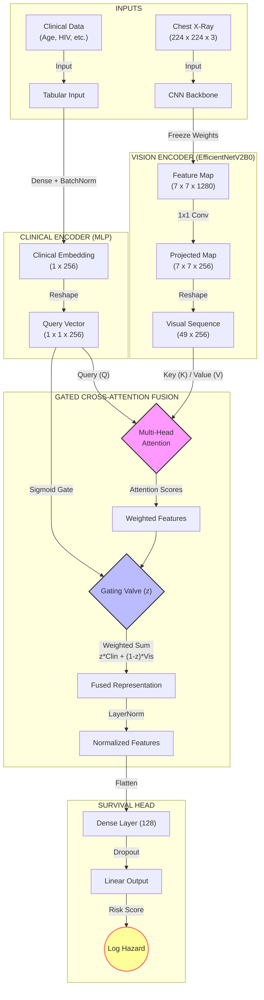

# 🫁 TBSurvivalNet: Multimodal Survival Analysis for Tuberculosis


**Author:** Dr. Ikechukwu Ephraim Ugbo, MD  
**Focus:** Cross-Modal Deep Learning (CXR + Clinical Data) for Prognosis

## 📌 Project Overview
**TBSurvivalNet (V3)** is a State-of-the-Art (SOTA) Multimodal AI framework designed to predict time-to-event (survival analysis) in Pulmonary Tuberculosis patients.

Unlike traditional "Late Fusion" models, this architecture utilizes **Gated Cross-Modal Attention**. The model treats clinical variables (e.g., HIV status, Age) as a **Query** that "searches" the Chest X-ray (the **Key/Value**) for relevant spatial features. A dynamic **Gating Mechanism** then learns to weight the importance of visual vs. clinical features per patient.

---

## 🏗️ Model Architecture (V3: EfficientNet + Gated Fusion)
The V3 architecture upgrades the backbone to **EfficientNetV2B0** and implements a learnable gate ($z$) to balance modalities.



### 🔬 Key Features

* **Backbone:** `EfficientNetV2B0` for superior parameter efficiency and convergence speed.
* **Gated Fusion:** A learnable "valve" that dynamically decides whether to trust the Image or Clinical data more for each specific patient. Inspired by **Ma et al. (CVPR 2022)**.
* **Training Dynamics:** Uses **Cosine Decay with Warmup** to stabilize the Attention layers during early training.
* **Loss Function:** Neural Cox Partial Likelihood.

---

## 🧬 Data Pipeline (Hybrid Real + Synthetic)

Due to the scarcity of public TB datasets with complete longitudinal survival data, this project employs a **scientifically grounded hybrid approach**:

1. **Real Images:** Uses the **Shenzhen Tuberculosis CXR Dataset** (Real X-rays, Age, Sex).
2. **Synthetic Clinical Data:** Missing covariates (HIV, BMI, Diabetes) are synthesized based on epidemiological prevalence.
3. **Smart Labeling:** Survival times are generated using a probabilistic hazard function based on radiographic severity (e.g., *cavitation*, *miliary patterns*) and comorbidities.

### 🛡️ Strict Data Hygiene

To prevent **Data Leakage**, the pipeline enforces:

* **3-Way Split:**
* **Train (70%):** For learning weights.
* **Validation (15%):** For Early Stopping and Scheduler.
* **Test (15%):** A pure hold-out set for final C-Index calculation.


* **Patient-Level Splitting:** Ensures all images from the same patient stay in the same split.
* **Fit/Transform Logic:** Tabular scalers (`StandardScaler`) are fit **only** on the Training set and applied to Val/Test.

---

## 📂 Repository Structure

```bash
tb-cxr-survival/
├── data/                   # (Ignored by Git)
│   ├── raw/                # Shenzhen Images
│   └── processed/          # master_dataset.csv
├── notebooks/
│   └── 01_tb_cxr_survival.ipynb  # Main End-to-End Notebook
├── src/
│   ├── config.py           # Hyperparameters & Seeds
│   ├── data_utils.py       # Data Loading, Splitting, & Augmentation
│   ├── model_utils.py      # TBSurvivalNet Architecture (Gated Fusion)
│   ├── survival_utils.py   # Custom Cox Loss & Hazard Functions
│   ├── callbacks.py        # Warmup Scheduler & C-Index Monitoring
│   └── explainability_utils.py # Grad-CAM & Clinical Patient Reports
└── outputs/                # Saved models (.keras) and logs

```

---

## 🚀 How to Run

1. **Install Dependencies:**
```bash
pip install -r requirements.txt

```


2. **Run the Notebook:**
Open `notebooks/01_tb_cxr_survival.ipynb`. The notebook handles the entire pipeline:
* Generates the hybrid dataset automatically.
* Trains `TBSurvivalNet` with Custom Cox Loss.
* Evaluates using the Concordance Index (C-Index).
* Generates **Grad-CAM Patient Reports** (Explainability).


---

## 📊 Performance Metrics

The model is evaluated using the **Harrell's Concordance Index (C-Index)** on the held-out Test Set.

* **Random Guessing:** 0.50
* **Clinical Baseline (CoxPH):** ~0.6114
* **TBSurvivalNet V3 (Target):** ~0.6252

---

## 📚 References

1. **Ma et al. (2022).** "Are Multimodal Transformers Robust to Missing Modality?" *Proceedings of the IEEE/CVF Conference on Computer Vision and Pattern Recognition (CVPR).*
2. **Wang et al. (2025).** "Missing-modality enabled multi-modal fusion architecture for medical data." *Journal of Biomedical Informatics.*
3. **Zhou et al. (2023).** "A transformer-based representation-learning model with unified processing of multimodal input." *Nature Biomedical Engineering.*
4. **Katzman et al. (2018).** "DeepSurv: Personalized treatment recommender system using a Cox proportional hazards deep neural network." *BMC Medical Research Methodology.*

```

```
